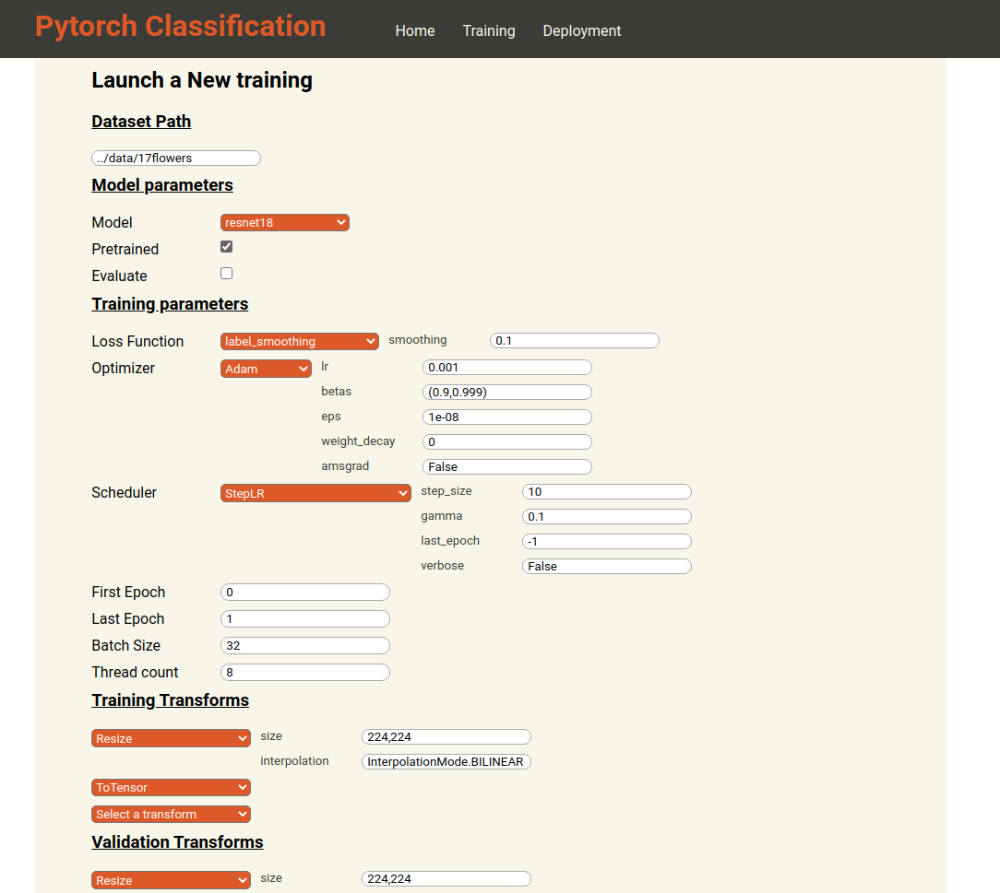
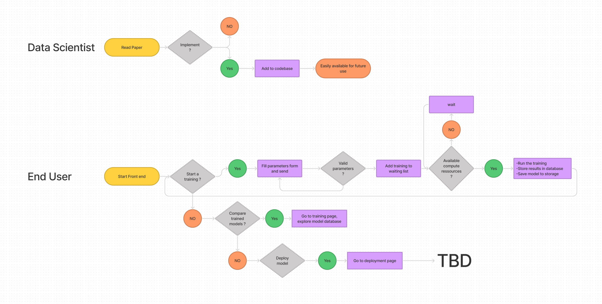

## About this repository

This is a personal project, mostly to learn some new technologies that I am not familiar with yet such as databases, HTML/CSS/Javascript and flask.

## Code structure

```
├───notebooks # Contains notebook for development mainly, some quick tests
├───parameters # Contains the parameters file for the experiments
├───src # Contains all the core code
│   ├───models # (will) Contain custom models and helper function related to models
│   ├───optimizer #
│   ├───transforms
│   ├───scheduler #
│   ├───losses #
│   ├───trainer # Only contains the trainer class, that handle the training steps.
├───app # Contains code for the front end and some helpers
│   ├───static # Contains CSS and Javascript code for the UI
│   │   └───javascript # Contains javascript code for the UI
│   ├───templates # Contains HTML templates files (JINJA templating)
│   ├───utils # Contains python code with helper function for the front/back end interface
├───readme_files # Contains auxiliary input for this readme.
└───tests
```

## How to use

I did not dockerize yet, I'll update the commands once it's done. in the mean time, dependancies are basically pytorch and flask.

### As a CLI

```
python train.py <path-to-your-parameters-json>
```

You can check the existing `parameters.json` file to see how it is done, and also refer to the `get_XXX.py` files to see available methods, as well as the pytorch documentation to see the parameters each function takes.

### As an App

While it's still in the development process, you can try and use the app by calling

```
python run.py
```

then head to the port `8000` of your machine and you should find this UI




### Flow chart 
Look something like that, might add details later



## TODOs

- [ ] Add a validation section
  - [x] Give sample of images that are wrongly classified (csv format)
  - [ ] Give metrics graphs (Confusion matrix done, probably adding some bar graphs)
  - [ ] Add grad cam or alike
  - [ ] Add perturbation and see how results evolve (Gaussian Noise, Saturation, Compression artefact)
- [ ] Write comments
- [ ] Add tests
- [ ] Frontend
  - [x] Create a parameters parser
  - [ ] make a link to tensorboard ?
  - [ ] Store training results in an object Database (mongo-db)
  - [ ] Make the previous training visible in the `training` section
  - [ ] Export validation section as HTML and make it accesible in the `training` section
- [ ] Add a flow chart in the readme
